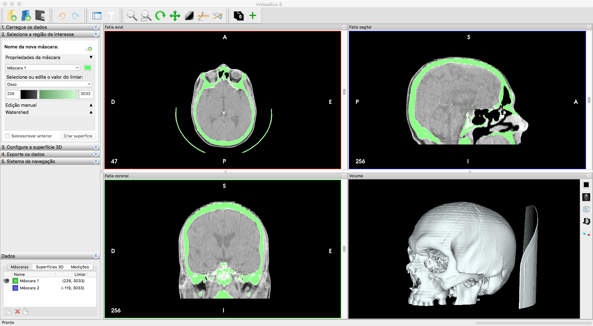
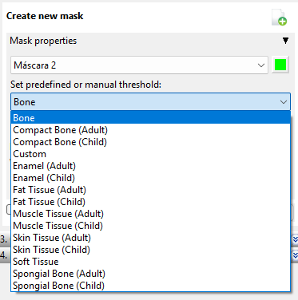
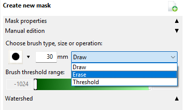
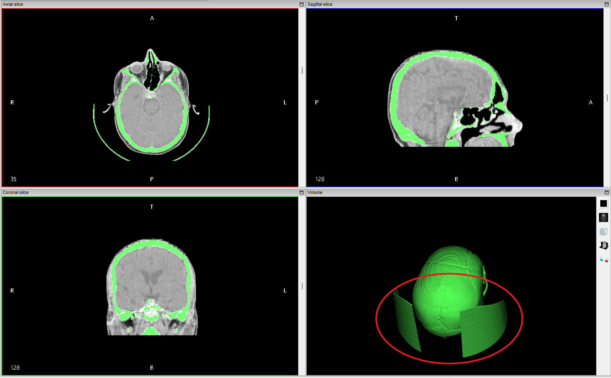

This blog post is here as the final work product of my [Google Summer of
Code](https://summerofcode.withgoogle.com) 2025 project with the InVesalius
organization, entitled [3D edition of
masks](https://summerofcode.withgoogle.com/programs/2025/projects/H1nIn5ni).

## Overview of InVesalius 3

[InVesalius 3](https://invesalius.github.io) ([invesalius/invesalius3 ](https://github.com/invesalius/invesalius3)) is a medical imaging
software that generates 3D reconstructions from DICOM files acquired with CT or MRI
equipment. The software provides comprehensive tools for medical image analysis
including segmentation, surface creation, volume rendering, and various measurement
tools. InVesalius also has impressive 3D printing support and exports 3D models in
`.stl`, `.obj`, and `.ply` formats.

::: {#fig-invesalius layout-ncol=1}
{.lightbox}

The InVesalius 3 interface
:::

## Project Goals

The standard workflow in InVesalius 3 is creating/manipulating masks and transforming
them into surfaces. Different tools to edit these masks already exist, whether it is
manually or by automatically thresholding certain intensity values (see @fig-edition).

::: {#fig-edition layout-ncol=2}

{.lightbox}

{.lightbox}

Manual and automatic 2D mask edition options in InVesalius 3.

:::

However, these tools are limited to 2D slices, which can be tedious and time-consuming.
**The project goal was to implement 3D mask edition tools** to allow users to edit masks
directly in the 3D view, making the process more intuitive and efficient. A typical use
case is removing unwanted structures with similar intensity values as the target
structure (see @fig-3dct).

::: {#fig-3dct layout-ncol=1}

{.lightbox}

Typical 3D surfaces to be removed from a surface created when intensity thresholding
is chosen for bone structures in CT scans.
:::

## What Was Implemented

A halfway through solution for this project was proposed in [GSOC
2024](https://github.com/invesalius/invesalius3/pull/822), but the PR was never merged.
The current implementation continues from this unmerged PR. The exact code can be found
[here 
](https://github.com/invesalius/invesalius3/pull/1006).

### Core 3D Mask Editing System
- **Interactive 3D Polygon Selection**: Users can draw polygons directly on the 3D
volume renderer to define regions for mask editing (keep/exclude inside polygon). The
polygons are drawn in the screen space and projected into the 3D volume based on the
current camera view.
- **Real-Time Visualization**: The current implementation provides immediate visual
feedback of the masked volume as the polygons are modified and ajusted.
- **Custom Cython Extension**: Optimized Cython code for high-performance that computes
the volumetric projection of the polygons.

### User Interface
- **VTK Style Integration**: The 3D editing mode is integrated into the existing
VTK-based interaction system. The style is automatically updated when checking the
checkbox for 3D manual editing. This was extensively refactored to ensure camera-aware
polygon projection and for the style to be better integrated with the application state
overall, for example:
    - Drawing polygons and then deleting them with the "Clear polygons" button will
    restore the mask to its original state.
    - The style is now camera-aware, meaning that if the user rotates the 3D view, the
    polygons will be reprojected correctly.
    - The polygon drawing has keyboard shortcuts that are very similar to other
    "polygon-drawing" tools in the application, such as the "Measure" tool.

::: {#vid-3dedit}



Video of the polygon drawing and mask edition in 3D view.

:::

*Disclaimer:* Final feedback from InVesalius mainteiners is still pending, so some
functionalities may change before final merging of the pull request.

## Bonus implementation

During the above implementation process, I also contributed to a debugging tool for the
InVesalius 3 application. We are talking about a wx-based GUI application here and it
can be tricky to debug when you are not in the correct context or state of the
application (for example, a few buttons and dropbdown menus must be clicked before
entering the VTK style for 3D mask edition). Luckily, `wxPython` provides a shell tool
that can be opened as a separate panel inside the application itself and that has access
to the entire application state.

The complete implementation can be found in [this merged PR ](https://github.com/invesalius/invesalius3/pull/1008). Here is a small video
of how this tool works:

::: {#vid-shell}



Interactive shell embedded in the InVesalius 3 application, with access to the entire
application state.

:::
